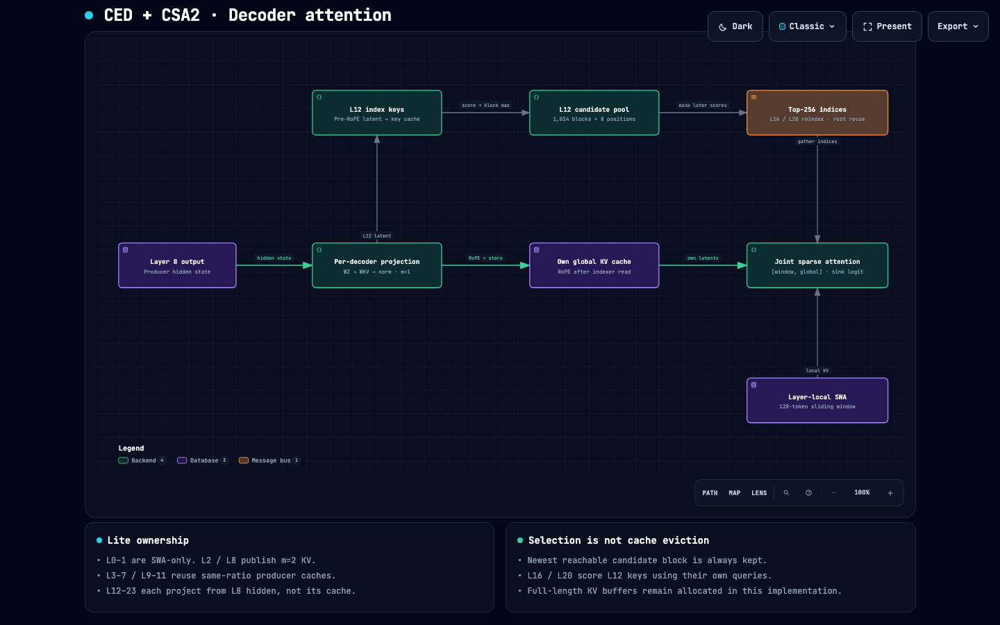

# DS-V4.1-Flash-Lite

A faithful from-scratch PyTorch replica of the **DeepSeek-V4.1-Flash**
architecture — CED compressed global-KV, CSA2 mode-routed sparse attention
with a hierarchical sparse indexer, sliding-window layers, mHC coefficients,
Engram memory, DeepSeekMoE, DSpark draft-verify decoding, and a ViT vision
front-end — re-sized to **~1.16B total / ~205M active parameters**, targeting
pre-training on **4× A100 80GB for ≤ $500**.

[](https://www.python.org/)
[](https://www.pytorch.org/)
[](#-status-measured-vs-honest-gaps)
[](docs/source-manifest.md)

[**Architecture**](#-architecture) · [**Status**](#-status-measured-vs-honest-gaps) · [**Quick start**](#-quick-start) · [**Docs**](#-documentation)

---

## 📖 Overview

The upstream release couples **nine interacting mechanisms** — most of them
barely documented publicly. This repo vendors the released reference under
[`upstream/`](upstream/) (MIT, pinned commit), cross-checks every fact against
the released `config.json` ([source manifest](docs/source-manifest.md)), and
re-derives the whole stack from scratch in readable PyTorch:

| Mechanism | Role | Contract |
|---|---|---|
| **CED** | Compressed encoder-KV global pathway — the KV source consumers are wired off a low-rank compressed cache | T1 |
| **CSA2** | Per-layer attention mode table (local SWA / global / Reindex) over a candidate block pool | T2–T3 |
| **Hierarchical sparse indexer** | 8h×64 indexer scores candidate blocks; Reindex layers search only the pool | T4 |
| **Engram** | Lookup-and-gate long-term memory module | T5 |
| **DSpark** | Draft + verify speculative decoding loop | T6 |
| **Attention core** | Shared attention semantics across all modes | T7 |
| **mHC** | Multi-head-mixing coefficient pipeline | T8 |
| **DeepSeekMoE** | Routed-expert gate | T9 |
| **ViT + aligner** | Vision front-end feeding the language stack | T10 |

FP8-E4M1 KV is a **post-production QAT gate** (D2 decision): the BF16 model is
the shipped artifact, so the indexer never learns around quantization noise
from scratch.

### How it fits the portfolio

| Project | Attention | Memory | MoE |
|---|---|---|---|
| [DeepSeek-v3-Lite](https://github.com/atandra2000/DeepSeek-v3-Lite) | MLA (latent KV) | compressed latent cache | DeepSeekMoE |
| [GPT-OSS-Lite](https://github.com/atandra2000/GPT-OSS-Lite) | SWA/full alternation + sinks | sliding-window cache | top-2 of 8 |
| [HiLS-Attention-Lite](https://github.com/atandra2000/HiLS-Attention-Lite) | learned sparse chunk attention | landmark top-k KV access | — |
| **DS-V4.1-Flash-Lite** | **CSA2 mode table + learned indexer** | **compressed global KV (CED) + FP8 map** | **DeepSeekMoE** |

---

## 🗺️ Visual Architecture Atlas

> Explore the full **[Interactive Visual Systems Guide](docs/diagrams/deepseek_v41_visual_guide.html)**: model + CSA2 architecture maps, data pipeline and training workflow, plus layer and selection-budget explorers.

<div align="center">
  <a href="docs/diagrams/deepseek_v41_visual_guide.html">
    
  </a>
  <p><em>Figure 1: CSA2 attention map — per-layer mode table, candidate-pool construction, and hierarchical indexer selection. Click image to open the interactive guide.</em></p>
</div>

| Diagram | Interactive HTML | Visual Preview |
|---|---|---|
| **Model architecture** | [Open Map ↗](docs/diagrams/architecture-model.html) | [PNG](docs/diagrams/architecture-model.visual-check.1440x900.dark.png) |
| **CSA2 attention** | [Open Map ↗](docs/diagrams/architecture-csa2.html) | [PNG](docs/diagrams/architecture-csa2.visual-check.1440x900.dark.png) |
| **Data pipeline** | [Open Map ↗](docs/diagrams/dataflow-data-pipeline.html) | [PNG](docs/diagrams/dataflow-data-pipeline.visual-check.1440x900.dark.png) |
| **Training workflow** | [Open Map ↗](docs/diagrams/workflow-training-loop.html) | [PNG](docs/diagrams/workflow-training-loop.visual-check.1440x900.dark.png) |

Interactive guides carry verification receipts ([validation + reproduction](docs/diagrams/RECEIPTS.md)).

---

## 🏗 Architecture

40-layer stack under the `lite-v3` config:

| Component | Spec |
|---|---|
| Layers | 40 (`compress_ratios`: 18× m=2, 18× m=1, 4 boundary, 3 DSpark target layers) |
| Total / active params | ~1.16B / ~205M |
| Attention | CSA2 mode table → local SWA, global, or Reindex (indexer top-k over candidate pool) |
| KV | CED compressed global-KV; BF16 shipped artifact, FP8-E4M1 as QAT gate (D2) |
| FFN | DeepSeekMoE routed experts |
| Decoding | DSpark draft + verify loop; headline decode asymmetry **~14.9× prefill/decode ms-per-token at toy dims** |
| Vision | ViT + aligner front-end |

---

## 🚀 Quick start

```bash
# Dev environment (macOS: CPU/MPS; 4×A100 rental is Phase 4)
uv venv .venv --python 3.12 && uv pip install -r requirements.txt
pytest tests/ -q                                            # 98-test suite

# Headline evaluation (prefill/decode asymmetry, KV bytes/token)
python scripts/eval_headline.py --config configs/lite-v3.json --device cpu \
    --out results/eval-headline.json

# Generation plumbing check
python scripts/gen.py --config configs/lite-v3.json
```

---

## 📚 Documentation

| doc | contents |
|---|---|
| [`docs/DESIGN-dsv41-flash-lite.md`](docs/DESIGN-dsv41-flash-lite.md) | design specification — architecture contract, Lite sizing, deviations |
| [`docs/EXECUTION-PLAN-dsv41-flash-lite.md`](docs/EXECUTION-PLAN-dsv41-flash-lite.md) | task order, gates, stop conditions |
| [`docs/architecture-contract.md`](docs/architecture-contract.md) | producer map, CSA2 mode table, per-mechanism semantics (pinned from upstream) |
| [`docs/source-manifest.md`](docs/source-manifest.md) | pinned upstream commit + file hashes |
| [`docs/diagrams/RECEIPTS.md`](docs/diagrams/RECEIPTS.md) | validation receipts + reproduction |

---

## 📊 Status: measured vs honest gaps

| item | status |
|---|---|
| Phase 0–2 (Tasks 1–9): contract, wiring, mode tables, CED/CSA2/Engram/DSpark/mHC/MoE/ViT | ✅ green |
| Task 11: trainer + recovery, GateRunner, executable variants, matched-token controls | ✅ CPU-verified (toy C0–C6 + bitwise repeat) |
| Task 14: headline metrics | ✅ CPU-measured at toy dims ([`results/eval-headline-toy.json`](results/eval-headline-toy.json)) |
| Task 10: production corpus prep | ❌ blocked on external sources (full GPT-2 `tokenizer.json` + FineWeb-Edu/DataComp) |
| Task 12: A100 200-step bitwise repeat + C0–C6 measured evidence | ❌ pending pod session |
| Production pre-training run (4× A100, ≤ $500) | ❌ Phase 4 |

## Upstream reference

Vendored under [`upstream/`](upstream/) — MIT: `deepseek-ai/DeepSeek-V4.1-Flash`
@ `dba1be0a40aa45a94ad051997016db3960a90277` (inference/ + encoding/ + config.json).